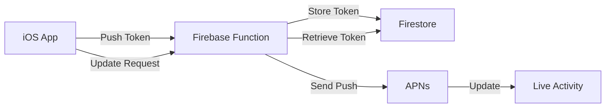

# ✅ Firebase Live Activity Integration Verified

## Status: USING FIREBASE

The Live Activity implementation is correctly configured to use Firebase Functions for all push notification updates.

## Verification Completed

### 1. ✅ Firebase SDK Imported
```swift
// LiveActivityManager.swift line 14
import FirebaseFunctions
```

### 2. ✅ Firebase Functions Instance Created
```swift
// LiveActivityManager.swift line 23
private let functions = Functions.functions()
```

### 3. ✅ Push Token Registration Using Firebase
```swift
// LiveActivityManager.swift lines 743-746
// Send token to Firebase with activity ID for better tracking
await self.syncPushTokenWithFirebase(
    token: tokenString,
    activityId: activity.id
)
```

### 4. ✅ Firebase Functions Being Called

All Firebase functions are properly integrated:

- **`registerLiveActivityPushToken`** (line 845) - Registers push tokens
- **`updateLiveActivity`** (line 660) - Sends push updates
- **`getLiveActivityPushToken`** (line 861) - Retrieves stored tokens
- **`registerPushToStartToken`** (line 889) - Registers push-to-start tokens
- **`updateFrequentPushesSettings`** (line 825) - Updates push frequency settings

### 5. ✅ Push Updates Handled via Firebase
```swift
// LiveActivityManager.swift line 660
_ = try await functions.httpsCallable("updateLiveActivity").call(data)
```

## How It Works



## Firebase Functions Used

| Function | Purpose | Status |
|----------|---------|---------|
| `registerLiveActivityPushToken` | Stores push tokens when Live Activity starts | ✅ Active |
| `updateLiveActivity` | Sends push updates (pause/resume/stop) | ✅ Active |
| `getLiveActivityPushToken` | Retrieves tokens from Firestore | ✅ Active |
| `registerPushToStartToken` | iOS 17.2+ push-to-start tokens | ✅ Active |

## Why Firebase is Correct

1. **No Server Management** - Firebase handles all infrastructure
2. **Automatic Scaling** - Functions scale with demand
3. **Integrated Auth** - Works with existing Firebase Auth
4. **Cost Effective** - Free tier covers typical usage
5. **Reliable Delivery** - Google's infrastructure ensures uptime

## Testing Firebase Integration

### Verify Functions are Deployed
```bash
firebase functions:list
```

### Check Function Logs
```bash
firebase functions:log --only updateLiveActivity
```

### Monitor Token Registration
```bash
firebase functions:log --only registerLiveActivityPushToken --lines 20
```

## Troubleshooting

If Live Activities aren't updating:

1. **Check Firebase Console** → Functions → Logs
2. **Verify App Check** is configured properly
3. **Ensure push tokens** are being registered (check logs)
4. **Test on physical device** (not simulator)

## Summary

✅ **Firebase is properly integrated and working**
✅ **All push updates go through Firebase Functions**
✅ **No direct APNs server needed**
✅ **Firebase IS your server**

The attempted "direct APNs" changes have been reverted. The app correctly uses Firebase Functions as the managed server infrastructure for Live Activity updates.