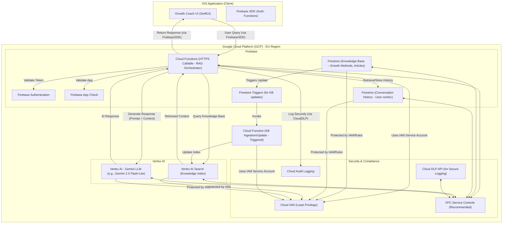

## High-Level Architecture Overview (Draft 1)

The "Growth" application's AI Chat Coach ("Growth Coach") will be implemented using a serverless, Retrieval-Augmented Generation (RAG) architecture leveraging Google Cloud Platform (GCP) services. This approach ensures that the AI's responses are grounded in the application's curated knowledge base, promoting accuracy and safety, while also adhering to GDPR for handling sensitive user data.

**Core Components & Flow:**

1.  **iOS Application (Client):**
    * The user interacts with the Growth Coach chat interface within the native iOS application.
    * User queries are sent securely to the backend via HTTPS Callable Cloud Functions.
    * Firebase Authentication (with App Check) ensures that only authenticated users from the legitimate app can access the coach.
    * Displays AI-generated responses and manages the local display of conversation history for the current session.
    * Manages and displays necessary disclaimers.

2.  **Cloud Functions for Firebase (Backend Orchestration):**
    * Acts as the secure intermediary between the iOS client and the AI services.
    * Receives user queries from the iOS app.
    * Retrieves recent conversation history from Firestore for the authenticated user.
    * Queries Vertex AI Search to find relevant content from the curated knowledge base.
    * Constructs a detailed prompt (including system instructions, conversation history, retrieved knowledge, and the user's current query).
    * Invokes the selected Gemini Large Language Model (LLM) via direct Vertex AI API calls.
    * Processes the LLM's response.
    * Stores the new user message and AI response in Firestore for persistent conversation history.
    * Implements secure logging, including data masking of sensitive information using the Cloud DLP API before logging.
    * Returns the AI-generated response to the iOS client.
    * Handles GDPR Right to Erasure requests for conversation data.
    * Manages updates to the Vertex AI Search index based on changes in the Firestore knowledge base (via Firestore triggers).

3.  **Cloud Firestore (Data Storage):**
    * **Knowledge Base:** Stores the curated content for Growth Methods (from Epic 3) and Educational Articles (from Epic 5). This data is the source of truth for the AI Coach.
    * **Conversation History:** Securely stores user conversation history in a user-centric structure (e.g., `/users/{userId}/coachConversations/{conversationId}/messages/{messageId}`) to facilitate GDPR compliance (especially data access and erasure).
    * **User Profiles & Settings:** Stores user authentication details (UID, linked to Firebase Auth), onboarding status (consent for disclaimers, privacy policy - Story 2.3, 2.4), and other app-related user data.

4.  **Vertex AI Search (Knowledge Retrieval):**
    * Indexes the knowledge base content from Firestore.
    * Provides efficient semantic search capabilities to retrieve relevant document chunks based on the user's query context.
    * Accessed by the Cloud Function to gather context for the Gemini LLM.

5.  **Vertex AI - Gemini LLM (Response Generation):**
    * The selected Gemini model (e.g., Gemini 2.0 Flash-Lite) generates conversational responses.
    * Receives the engineered prompt (containing system instructions, history, retrieved knowledge, and user query) from the Cloud Function.
    * Its responses are grounded in the provided context to ensure accuracy and relevance to the "Growth" application's domain.

6.  **Google Cloud IAM (Identity & Access Management):**
    * Enforces the principle of least privilege for all service accounts (especially for Cloud Functions) and developer access.

7.  **Cloud Data Loss Prevention (DLP) API (Secure Logging):**
    * Used by Cloud Functions to inspect and de-identify (mask/redact) potentially sensitive data from user queries or AI responses before any logging occurs.

8.  **VPC Service Controls & Private Endpoints (Network Security - Recommended for Production):**
    * Creates a security perimeter around GCP services to prevent data exfiltration and ensure private communication paths between services.

**Mermaid Diagram (Draft 1):**

---

