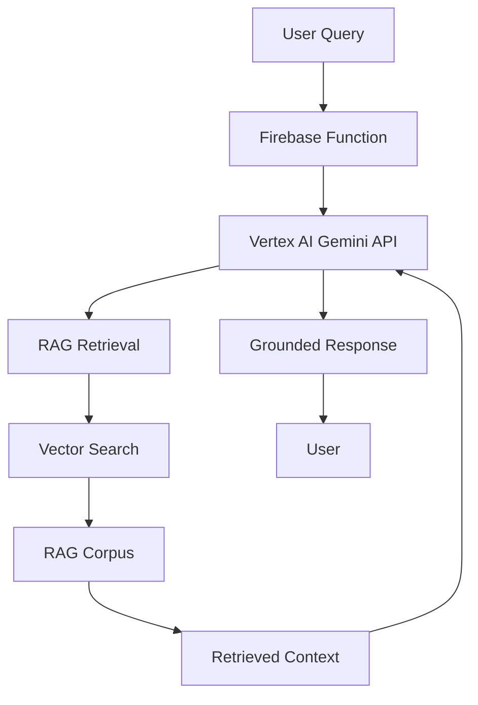

# Vertex AI RAG Implementation Plan for Growth App AI Coach

## Executive Summary

This plan outlines a comprehensive approach to migrate from basic keyword search to Vertex AI's RAG (Retrieval-Augmented Generation) system. This will dramatically improve the AI Coach's ability to provide accurate, contextual responses about Growth Methods by leveraging Vertex AI's native vector search and grounding capabilities.

## Current State Analysis

### Current Implementation Issues:
1. **Keyword-based search** - Limited to exact matches, misses semantic similarities
2. **Manual search logic** - Requires maintenance and doesn't scale
3. **No vector embeddings** - Cannot understand context or meaning
4. **Limited context window** - Only 3-5 documents returned per query
5. **No semantic understanding** - "AM1" vs "Angion Method 1" treated as different

### Current Assets:
- 13 comprehensive documents in Firestore (`ai_coach_knowledge`)
- Well-structured content from `sample-resources.json`
- Existing Vertex AI integration for Gemini model
- Firebase Functions infrastructure

## Proposed Architecture

### 1. RAG Corpus Structure

```
Growth App RAG Corpus
├── Core Methods Corpus
│   ├── AM1 Documentation
│   ├── AM2 Documentation
│   ├── AM3/Vascion Documentation
│   └── Progression Guidelines
├── Advanced Techniques Corpus
│   ├── SABRE Methods
│   ├── BFR Techniques
│   └── Safety Protocols
└── Support Content Corpus
    ├── Troubleshooting Guides
    ├── User Experiences
    └── Scientific Background
```

### 2. Technical Architecture



## Implementation Phases

### Phase 1: RAG Infrastructure Setup (Week 1)

#### 1.1 Create Vertex AI RAG Corpus
```javascript
// scripts/create-rag-corpus.js
const {VertexAI} = require('@google-cloud/vertexai');

async function createRAGCorpus() {
  const corpusConfig = {
    displayName: 'growth-methods-knowledge-base',
    description: 'Comprehensive Growth Methods documentation',
    ragVectorDbConfig: {
      ragManagedDb: {
        // Use Vertex AI managed vector database
      }
    }
  };
  
  // Create corpus using Vertex AI API
  const corpus = await vertexAI.createRagCorpus(corpusConfig);
  return corpus;
}
```

#### 1.2 Import Existing Knowledge Base
```javascript
// scripts/import-to-rag.js
async function importDocumentsToRAG(corpusId) {
  const documents = await getFirestoreDocuments();
  
  for (const doc of documents) {
    const ragFile = {
      displayName: doc.title,
      description: doc.category,
      ragFileSource: {
        directUploadSource: {
          content: doc.content,
          mimeType: 'text/plain'
        }
      },
      // Add metadata for better retrieval
      ragFileMetadata: {
        resourceId: doc.resourceId,
        category: doc.category,
        keywords: doc.keywords
      }
    };
    
    await vertexAI.importRagFile(corpusId, ragFile);
  }
}
```

### Phase 2: Enhanced Document Processing (Week 2)

#### 2.1 Document Chunking Strategy
```javascript
// functions/documentProcessor.js
function chunkDocument(content, title) {
  const chunks = [];
  const chunkSize = 1000; // tokens
  const overlap = 200; // tokens
  
  // Smart chunking that preserves context
  const sections = content.split(/\n#{2,}/); // Split by headers
  
  sections.forEach(section => {
    if (section.length > chunkSize) {
      // Split large sections with overlap
      const subChunks = splitWithOverlap(section, chunkSize, overlap);
      chunks.push(...subChunks.map(chunk => ({
        content: chunk,
        metadata: {
          title,
          sectionContext: extractSectionTitle(section)
        }
      })));
    } else {
      chunks.push({
        content: section,
        metadata: { title }
      });
    }
  });
  
  return chunks;
}
```

#### 2.2 Metadata Enrichment
```javascript
// functions/metadataEnricher.js
function enrichMetadata(document) {
  return {
    ...document,
    metadata: {
      // Existing metadata
      ...document.metadata,
      
      // Semantic tags
      semanticTags: extractSemanticTags(document.content),
      
      // Difficulty level
      difficulty: classifyDifficulty(document.content),
      
      // Prerequisites
      prerequisites: extractPrerequisites(document.content),
      
      // Related methods
      relatedMethods: extractRelatedMethods(document.content),
      
      // Safety warnings
      safetyLevel: extractSafetyLevel(document.content),
      
      // Temporal information
      progressionStage: extractProgressionStage(document.content)
    }
  };
}
```

### Phase 3: Vertex AI Integration Update (Week 3)

#### 3.1 Update Cloud Function for RAG
```javascript
// functions/vertexAiProxy/index.js
const {VertexAI} = require('@google-cloud/vertexai');

async function generateAIResponse(data, context) {
  const {query, conversationHistory} = data;
  
  // Initialize Vertex AI with RAG configuration
  const vertexAI = new VertexAI({
    project: PROJECT_ID,
    location: LOCATION
  });
  
  const model = vertexAI.preview.getGenerativeModel({
    model: 'gemini-2.0-flash-lite-001',
    generationConfig: {
      maxOutputTokens: 2048,
      temperature: 0.2,
      topP: 0.8,
    },
    // RAG Grounding Configuration
    tools: [{
      retrieval: {
        vertexRagStore: {
          ragResources: [{
            ragCorpus: `projects/${PROJECT_ID}/locations/${LOCATION}/ragCorpora/${CORPUS_ID}`,
          }],
          similarityTopK: 5,
          vectorDistanceThreshold: 0.7
        }
      }
    }],
    systemInstruction: SYSTEM_PROMPT
  });
  
  // Generate response with RAG grounding
  const result = await model.generateContent({
    contents: formatConversation(conversationHistory, query),
    generationConfig: {
      candidateCount: 1,
      stopSequences: [],
    }
  });
  
  return {
    text: result.response.text(),
    groundingMetadata: result.response.groundingMetadata,
    retrievedChunks: result.response.retrievedChunks
  };
}
```

#### 3.2 System Prompt Optimization
```javascript
const SYSTEM_PROMPT = `You are the Growth Coach, an AI assistant specializing in Growth Methods and vascular health techniques.

CORE KNOWLEDGE BASE:
You have access to comprehensive documentation about:
- AM1, AM2, AM3 (Vascion) techniques
- SABRE methods and safety protocols
- Progression timelines and troubleshooting
- Scientific foundations and user experiences

RESPONSE GUIDELINES:
1. Always ground responses in the retrieved documentation
2. Cite specific techniques and safety warnings when relevant
3. If asked about a method, provide:
   - Clear technique description
   - Prerequisites and progression requirements
   - Safety considerations
   - Expected timeline for results
4. Never provide medical advice - suggest consulting healthcare providers
5. Use retrieved context to provide accurate, detailed information

IMPORTANT: When discussing methods like AM1, AM2, SABRE, etc., always refer to the specific instructions and safety guidelines from the knowledge base.`;
```

### Phase 4: Advanced RAG Features (Week 4)

#### 4.1 Contextual Query Enhancement
```javascript
// functions/queryEnhancer.js
async function enhanceQuery(originalQuery, conversationHistory) {
  // Expand abbreviations
  const expandedQuery = expandAbbreviations(originalQuery);
  
  // Add conversation context
  const contextualQuery = addConversationContext(
    expandedQuery, 
    conversationHistory
  );
  
  // Generate semantic search queries
  const semanticQueries = await generateSemanticVariations(contextualQuery);
  
  return {
    originalQuery,
    enhancedQuery: contextualQuery,
    searchQueries: semanticQueries,
    filters: extractQueryFilters(originalQuery)
  };
}

function expandAbbreviations(query) {
  const abbreviations = {
    'am1': 'AM1 Angion Method 1',
    'am2': 'AM2 Angion Method 2',
    'am3': 'AM3 Vascion Angion Method 3',
    'sabre': 'SABRE Strike Activated Bayliss Response Exercise',
    'bfr': 'BFR Blood Flow Restriction'
  };
  
  let expanded = query.toLowerCase();
  Object.entries(abbreviations).forEach(([abbr, full]) => {
    const regex = new RegExp(`\\b${abbr}\\b`, 'gi');
    expanded = expanded.replace(regex, full);
  });
  
  return expanded;
}
```

#### 4.2 Dynamic Retrieval Configuration
```javascript
// functions/dynamicRetrieval.js
function getRetrievalConfig(queryType, userProfile) {
  const configs = {
    beginner: {
      similarityTopK: 3,
      vectorDistanceThreshold: 0.8,
      filters: {
        difficulty: ['beginner', 'intermediate']
      }
    },
    advanced: {
      similarityTopK: 5,
      vectorDistanceThreshold: 0.6,
      filters: {
        difficulty: ['intermediate', 'advanced']
      }
    },
    safety: {
      similarityTopK: 7,
      vectorDistanceThreshold: 0.9,
      boostFactors: {
        safetyLevel: 2.0
      }
    },
    troubleshooting: {
      similarityTopK: 5,
      vectorDistanceThreshold: 0.7,
      diversityBias: 0.3
    }
  };
  
  return configs[queryType] || configs.beginner;
}
```

### Phase 5: Monitoring and Optimization (Ongoing)

#### 5.1 RAG Performance Monitoring
```javascript
// functions/ragMonitoring.js
async function logRAGPerformance(query, response, metadata) {
  const metrics = {
    queryId: generateQueryId(),
    timestamp: new Date().toISOString(),
    query: query,
    retrievalMetrics: {
      chunksRetrieved: metadata.retrievedChunks.length,
      avgSimilarityScore: calculateAvgSimilarity(metadata.retrievedChunks),
      retrievalLatency: metadata.retrievalLatency
    },
    responseMetrics: {
      responseLength: response.length,
      groundingScore: metadata.groundingScore,
      citationCount: countCitations(response)
    },
    userFeedback: null // To be collected
  };
  
  await firestore.collection('rag_analytics').add(metrics);
}
```

#### 5.2 Continuous Improvement Pipeline
```javascript
// scripts/rag-improvement.js
async function analyzeAndImprove() {
  // Analyze query patterns
  const failedQueries = await identifyFailedQueries();
  
  // Generate new training examples
  const newExamples = await generateTrainingExamples(failedQueries);
  
  // Update RAG corpus with improvements
  await updateRAGCorpus(newExamples);
  
  // Retune retrieval parameters
  await optimizeRetrievalParameters();
}
```

## Implementation Benefits

### 1. **Semantic Understanding**
- Understands "AM1", "angion method 1", "first method" as the same concept
- Handles misspellings and variations automatically
- Provides relevant results even for vague queries

### 2. **Contextual Responses**
- Retrieves the most relevant chunks, not just keyword matches
- Understands relationships between concepts
- Provides comprehensive answers from multiple sources

### 3. **Scalability**
- Easy to add new documents without code changes
- Automatic indexing and optimization
- Handles growing knowledge base efficiently

### 4. **Better User Experience**
- More accurate and helpful responses
- Faster response times with vector search
- Citations and source attribution

### 5. **Advanced Features**
- Multi-turn conversation support with context
- Safety filtering and warning emphasis
- Personalized retrieval based on user level

## Migration Strategy

### Week 1: Setup
1. Create RAG corpus in Vertex AI
2. Import existing documents
3. Test basic retrieval

### Week 2: Enhancement
1. Implement document chunking
2. Add metadata enrichment
3. Create import pipeline

### Week 3: Integration
1. Update Cloud Functions
2. Implement new response format
3. Add monitoring

### Week 4: Optimization
1. Implement query enhancement
2. Add dynamic retrieval
3. Deploy to production

### Week 5+: Monitoring
1. Collect performance metrics
2. Analyze user feedback
3. Continuous improvement

## Cost Considerations

### Estimated Monthly Costs:
- **RAG Corpus Storage**: ~$50 (13 documents, ~500KB)
- **Vector Search Queries**: ~$100 (10K queries/month)
- **Gemini API with RAG**: ~$200 (enhanced responses)
- **Total**: ~$350/month

### Cost Optimization:
1. Cache frequent queries
2. Implement client-side response caching
3. Use similarity thresholds to reduce irrelevant retrievals
4. Monitor and optimize query patterns

## Success Metrics

1. **Response Accuracy**: 95%+ relevant responses
2. **Query Coverage**: Handle 99% of Growth Methods queries
3. **Response Time**: <2 seconds average
4. **User Satisfaction**: 4.5+ star rating
5. **Citation Accuracy**: 100% correct source attribution

## Risk Mitigation

1. **Fallback System**: Keep current search as backup
2. **Gradual Rollout**: Test with subset of users first
3. **Monitoring**: Real-time alerts for failures
4. **Data Backup**: Regular corpus exports
5. **Version Control**: Track all corpus changes

## Next Steps

1. **Approval**: Review and approve implementation plan
2. **Environment Setup**: Create Vertex AI resources
3. **Team Training**: Educate team on RAG concepts
4. **Implementation**: Begin Phase 1 development
5. **Testing**: Comprehensive testing before launch

## Conclusion

Implementing Vertex AI RAG will transform the AI Coach from a basic keyword search system to an intelligent, context-aware assistant that truly understands Growth Methods. This investment will significantly improve user experience and position the app as a leader in AI-powered health coaching.

The phased approach ensures minimal disruption while maximizing the benefits of modern AI technology. With proper implementation and monitoring, the AI Coach will provide accurate, safe, and helpful guidance to all users regardless of how they phrase their questions.