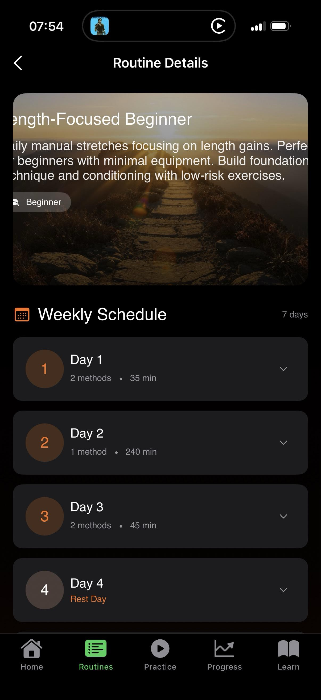

# Ad 05: Results Angle - Progress Proof (Megathread)

## Ad Details

| Field | Value |
|-------|-------|
| **Ad Name** | Results Angle - Progress Proof Megathread |
| **Post Type** | FREE-FORM |
| **Call to Action** | INSTALL |
| **Status** | PAUSED |
| **Ratio** | 4:5 (optimized for mobile) |
| **Allow Comments** | TRUE |

---

## Post Title (Max 300 characters)
```
6 Months of PE Progress: What Actually Worked (Data Inside)
```

---

## FREE-FORM Body (Megathread Format)

```markdown
**TL;DR:** 0.5" gain in 6 months. The "secret"? Never missing sessions. I tracked everything and built an app to keep myself accountable. Here's what the data shows.

---

## TABLE OF CONTENTS

1. The Before (My Starting Point)
2. The Method (What I Actually Did)
3. The Data (6 Months of Tracking)
4. The Turning Point
5. The App I Built

---

## 1. THE BEFORE

- **Time in PE:** 2+ years (mostly inconsistent)
- **Previous attempts:** Dozens of "fresh starts"
- **Gains in those 2 years:** Basically nothing measurable

The methods weren't the problem. **I was the problem.**

---

## 2. THE METHOD

📌 **Routine:** Basic beginner stuff from r/TheScienceOfPE


*Choose Your Path - Balanced Beginner, Length-Focused, Intermediate options*

📌 **Time commitment:** 15-20 minutes/day

📌 **The real change:** I stopped letting myself skip


*Weekly Schedule: Day 1 (2 methods, 35 min), Day 2, Day 3, Day 4 (Rest Day)*

---

## 3. THE DATA

Here's what my progress tracking actually shows:


*BPEL tracking: Current 5.95" | Baseline 5.51" | Gain +0.44" | +8.0%*

**Month 1:** 28/30 sessions, no measurable gains
**Month 2:** 29/30 sessions, +0.1" (within margin of error)
**Month 3:** 30/30 sessions, +0.2" total
**Month 4-6:** 95%+ consistency, **+0.5" total**

### Key Stats Dashboard


*Key Metrics: Total Sessions, Total Time, Average Session, Routine Adherence %*

---

## 4. THE TURNING POINT

> I built a timer that shows on my Lock Screen and won't go away until I finish my session.


*Basic Manual Stretch - 23:53 remaining - Pause/Stop buttons on Lock Screen*

This was the game-changer. No more:
- "Just 5 more minutes of this video..."
- *dismisses notification*
- *completely forgets*

The timer is **right there**. Can't use your phone normally until you're done.

---

## 5. THE APP I BUILT

**Growth Training** - the accountability system that finally worked for me:

### 🔒 Lock Screen Timer
Persistent, can't dismiss - you WILL remember your session

### 📏 Measurement Logging


*Track BPEL, NBPEL, MSEG, BEG with easy sliders - EQ rating 1-10*

Consistent methodology every time:
- BPEL, NBPEL, BPFSL (Length)
- MSEG, BEG (Girth)
- Erection Quality tracking

### 📈 Progress Charts
Visualize your gains over time - **this is what keeps you motivated**

### 🏠 Home Dashboard


*Today's Focus (Day 1, Length Day), Weekly Progress (7 day streak), Track Measurements*

### 🔐 100% Private
No account required, anonymous by default

---

## THE MATH

**Free trial available.** Less than $1/week after.

TIL the gains weren't hiding in some secret routine. They were hiding behind my inconsistency.

---

*Happy to discuss in comments. Not trying to sell you on anything - just sharing what finally worked after 2 years of spinning my wheels.*

[INSTALL NOW]
```

---

## Screenshot Placements Summary

| Section | Screenshot | Filename |
|---------|------------|----------|
| The Method - Routine | Routine selection | `routine-selection.jpeg` |
| The Method - Schedule | Weekly schedule | `routine-details-weekly.jpeg` |
| The Data - Progress | BPEL gains chart | `progress-chart-gains.jpeg` |
| The Data - Stats | Key Metrics dashboard | `stats-dashboard.jpeg` |
| The Turning Point | Lock Screen Timer | `lock-screen-timer.jpeg` |
| Measurement Logging | Basic measurements | `measurement-logging-basic.jpeg` |
| Home Dashboard | Today's Focus | `home-dashboard.jpeg` |

---

## Targeting

| Field | Value |
|-------|-------|
| **Campaign** | Growth Training - PE Accountability App - Q4 2024 |
| **Ad Group** | PE Community - Interest Targeting |
| **Campaign ID** | 2381056086187314348 |
| **Ad Group ID** | 2381056975948045977 |

---

## Reddit Best Practices Applied

| Best Practice | How Applied |
|---------------|-------------|
| **Build for mobile** | 4:5 ratio, scannable month-by-month breakdown |
| **Be your brand-self** | Real data, authentic story, transparent |
| **Show your product** | 7 screenshots showing actual app data |
| **Reddit like Reddit** | TIL, megathread format, FAQ, subreddit references |
| **Be prescriptive** | Clear before/after, specific timeframes |
| **Generate FOMO** | Results-based proof with specific numbers |
| **Enable comments** | TRUE - invite discussion |
| **TL;DR first** | Key results upfront for skimmers |

---

## A/B Testing Notes

- Progress chart screenshot is KEY - shows real gains
- Test specific numbers (0.5") vs general claims
- Lock Screen timer screenshot demonstrates core value
- Monitor credibility in comments - adjust if pushback
