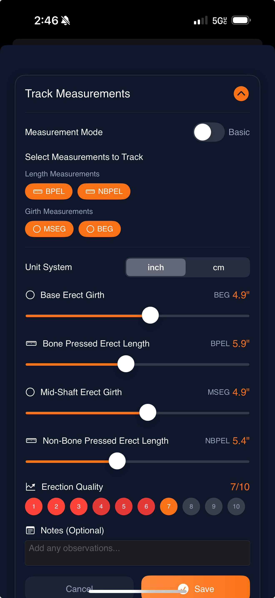
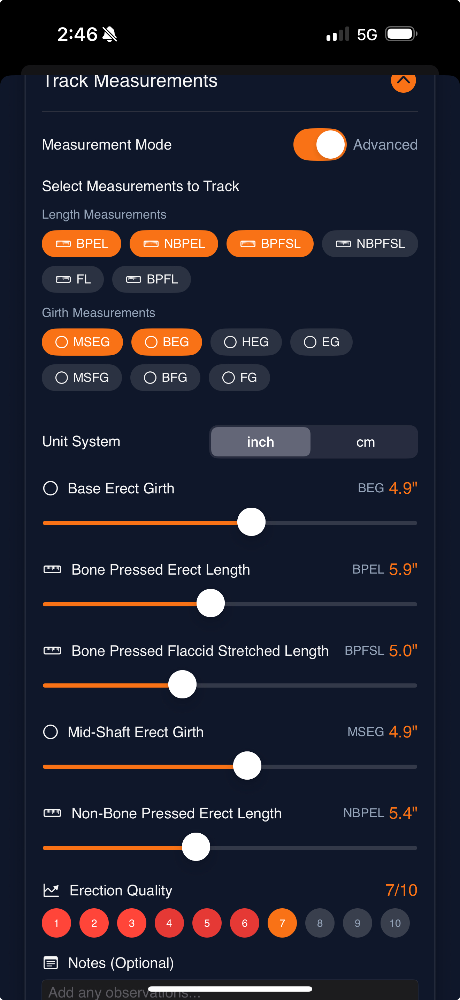
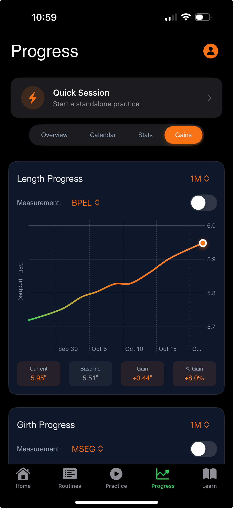
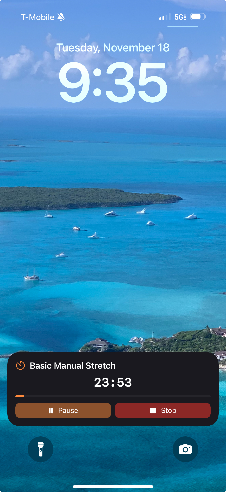
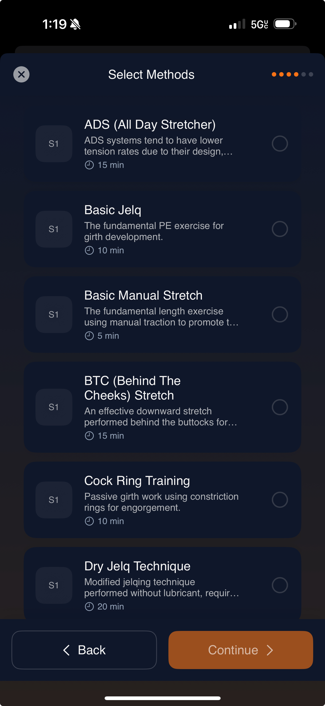
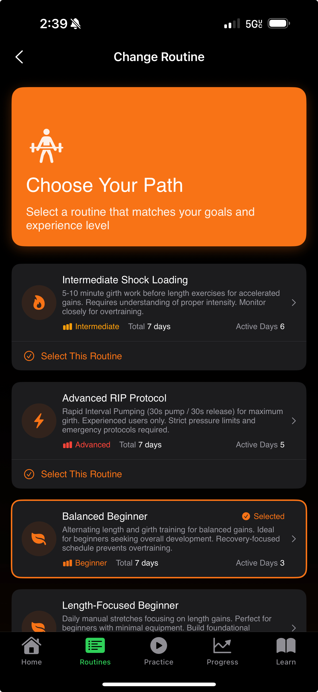
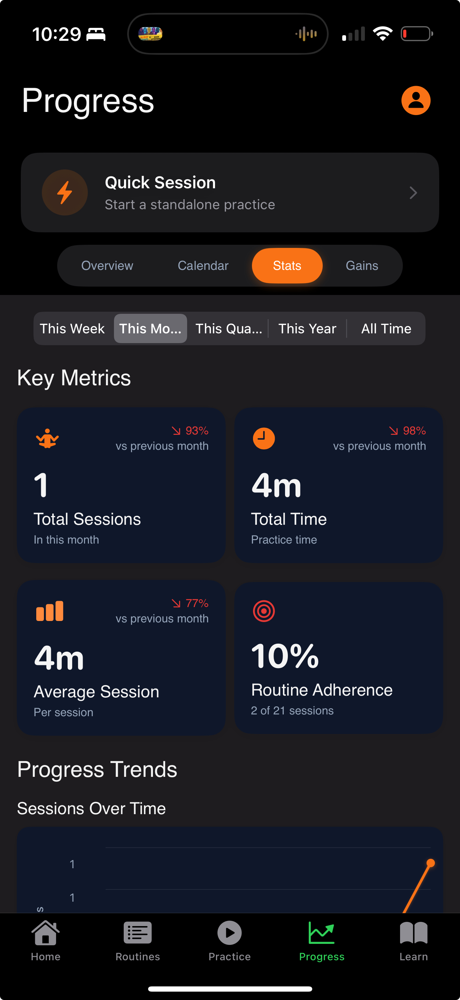
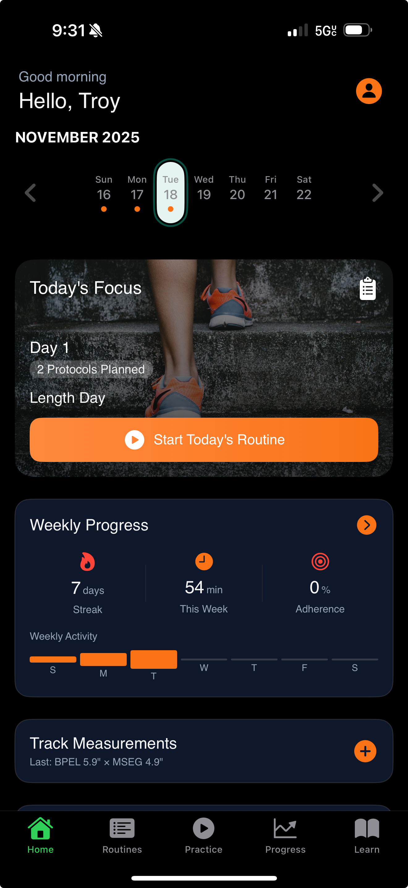
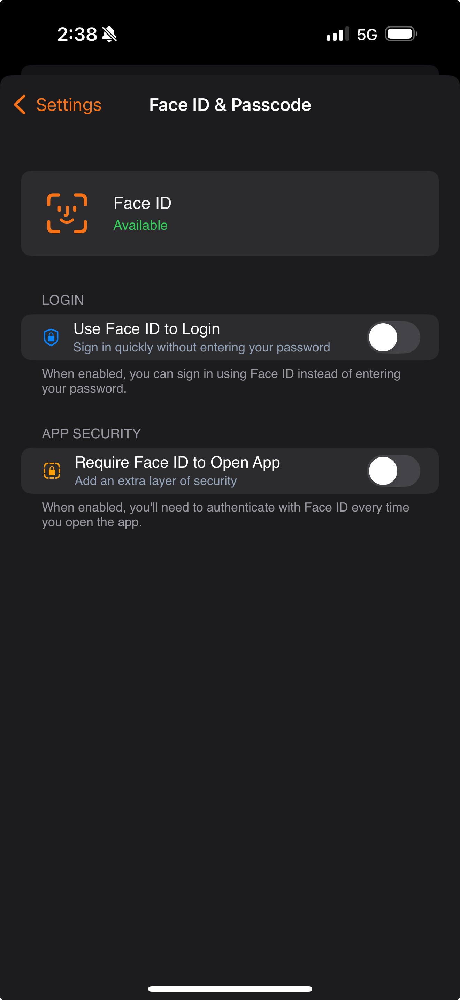

# Ad 06: Science-Based - Measurement Methodology (Megathread)

## Ad Details

| Field | Value |
|-------|-------|
| **Ad Name** | Science-Based - Measurement Methodology Megathread |
| **Post Type** | FREE-FORM |
| **Call to Action** | LEARN MORE |
| **Status** | PAUSED |
| **Ratio** | 4:5 (optimized for mobile) |
| **Allow Comments** | TRUE |

---

## Post Title (Max 300 characters)
```
A Redditor's Guide to PE Measurement & Tracking: The System I Built After Reading r/TheScienceOfPE
```

---

## FREE-FORM Body (Megathread Format)

```markdown
**TL;DR:** ICYMI - r/TheScienceOfPE taught me that measurement consistency is everything. Most guys fail PE not because methods don't work, but because they can't track accurately or stay consistent. Built an app to fix both. Your data stays 100% private.

---

## TABLE OF CONTENTS

1. Why Measurement Matters
2. The Tracking Problem
3. What r/TheScienceOfPE Taught Me
4. The System I Built
5. Privacy (Non-Negotiable)

---

## 1. WHY MEASUREMENT MATTERS

If you've spent any time on r/TheScienceOfPE, you've probably seen:

> "I've been doing PE for 6 months and I don't know if it's working"

The problem:
📌 **Inconsistent measurement technique**
📌 **No baseline to compare against**
📌 **Inconsistent sessions**

---

## 2. THE TRACKING PROBLEM

**What didn't work for me:**
❌ Spreadsheets (too much friction)
❌ Notes app (unstructured)
❌ Memory (unreliable)

**What I needed:**
✅ Quick logging (< 30 seconds)
✅ Consistent methodology
✅ Visual progress over time
✅ Privacy

---

## 3. WHAT r/TheScienceOfPE TAUGHT ME

- **Measurement Consistency > Measurement Frequency**
- **Track Your Inputs, Not Just Outputs**
- **Visual Progress Motivates Consistency**
- "The best routine is the one you'll actually stick to"

---

## 4. THE SYSTEM I BUILT

**Growth Training** - the PE tracking system r/TheScienceOfPE deserves.

### 📏 Measurement Logging

Track BPEL, NBPEL, BPFSL, MSEG, BEG consistently with standardized methodology:


*Basic Mode: BPEL, NBPEL, MSEG, BEG with slider inputs - includes EQ rating 1-10*


*Advanced Mode: Full measurement suite - BPEL, NBPEL, BPFSL, NBPFSL, FL, BPFL + All girth options (MSEG, BEG, HEG, EG, MSFG, BFG, FG)*

---

### 📊 Progress Visualization

Charts showing trends over time - **see the data that proves it's working**:


*Length Progress: BPEL tracking with Current (5.95"), Baseline (5.51"), Gain (+0.44"), % Gain (+8.0%) - visual trend line over time*

---

### 🔒 Lock Screen Timer

The accountability feature that changed everything:


*Timer on Lock Screen - Basic Manual Stretch 23:53 - Pause/Stop buttons accessible without unlocking*

- Timer persists on Lock Screen
- Can't dismiss it accidentally
- You WILL remember your session

---

### 📚 Research-Based Routines

Methods library based on r/TheScienceOfPE community-proven techniques:


*Select Methods: ADS (All Day Stretcher), Basic Jelq, Basic Manual Stretch, BTC Stretch, Cock Ring Training, Dry Jelq Technique - each with duration estimates*


*Choose Your Path: Intermediate Shock Loading, Advanced RIP Protocol, Balanced Beginner (Selected), Length-Focused Beginner - with difficulty levels and active days*

---

### 📈 Session & Stats Tracking


*Key Metrics: Total Sessions (1), Total Time (4m), Average Session (4m), Routine Adherence (10%) - Progress Trends chart below*


*Today's Focus: Day 1, 2 Protocols Planned, Length Day - Weekly Progress showing 7 day streak, 54 min this week*

---

## 5. PRIVACY (NON-NEGOTIABLE)

🔐 **Your data stays private:**


*Face ID & Passcode settings: "Require Face ID to Open App - Add an extra layer of security"*

| Feature | How It Works |
|---------|--------------|
| **No account required** | Start tracking immediately |
| **Anonymous by default** | We don't know who you are |
| **Local storage** | Data stays on YOUR device |
| **Biometric lock** | Face ID/Touch ID available |
| **No social features** | No sharing, no leaderboards |

---

## THE VALUE

**Free trial available** - less than $1/week after.

This is the tracking system I wish existed when I started reading r/TheScienceOfPE.

---

*Happy to discuss methodology, tracking approaches, or answer questions in comments. This community taught me - hoping to give back.*

[LEARN MORE]
```

---

## Screenshot Placements Summary

| Section | Screenshot | Filename |
|---------|------------|----------|
| Measurement - Basic | Basic mode with sliders | `measurement-logging-basic.jpeg` |
| Measurement - Advanced | Full measurement suite | `measurement-logging-advanced.jpeg` |
| Progress Charts | BPEL gains visualization | `progress-chart-gains.jpeg` |
| Lock Screen Timer | Timer on Lock Screen | `lock-screen-timer.jpeg` |
| Methods Library | Exercise selection | `methods-library.jpeg` |
| Routine Selection | Choose Your Path | `routine-selection.jpeg` |
| Stats Dashboard | Key Metrics | `stats-dashboard.jpeg` |
| Home Dashboard | Today's Focus | `home-dashboard.jpeg` |
| Privacy | Face ID settings | `privacy-face-id.jpeg` |

---

## Targeting

| Field | Value |
|-------|-------|
| **Campaign** | Growth Training - PE Accountability App - Q4 2024 |
| **Ad Group** | PE Community - Interest Targeting |
| **Campaign ID** | 2381056086187314348 |
| **Ad Group ID** | 2381056975948045977 |

---

## Reddit Best Practices Applied

| Best Practice | How Applied |
|---------------|-------------|
| **Build for mobile** | 4:5 ratio, tables for scannable info |
| **Be your brand-self** | Transparent about app, credits community |
| **Show your product** | 9 screenshots showing measurement & tracking features |
| **Reddit like Reddit** | ICYMI, megathread format, r/subreddit references |
| **Be prescriptive** | Clear methodology, specific measurement types |
| **Talk the talk** | Uses BPEL, NBPEL, BPFSL, MSEG, BEG terminology |
| **Enable comments** | TRUE - analytical audience will have questions |
| **TL;DR first** | Summary for skimmers |

---

## A/B Testing Notes

- Best suited for r/TheScienceOfPE targeting specifically
- Measurement screenshots (Basic vs Advanced) showcase depth
- Test "LEARN MORE" vs "INSTALL" CTA
- Privacy section may resonate strongly - test placement
- Monitor comments for methodology questions
- Progress chart showing actual gains is compelling proof
